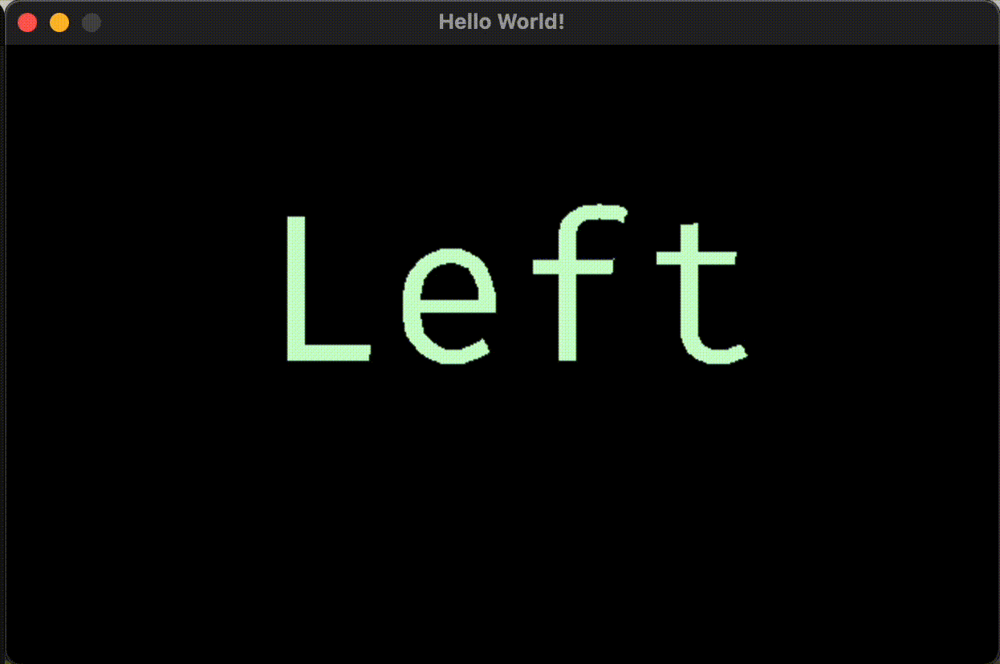

# C SDL2 Example

This is an example/straw men for how to use C and SDL2 to create simple text and image rendering with [LSL](https://labstreaminglayer.readthedocs.io/) connections.
It gives a first idea of how one could implement a module that can later be used within the [Dareplane](https://github.com/bsdlab/Dareplane) framework as part of a closed-loop implementation. The closed-loop capability is realized by listening to an LSL stream and changing the behaviour depending on a specific marker within that stream.

## Build

We first focus on a simple example of building an executable which uses SDL2 to display text and an image, while listening to an incoming LSL stream and outputting to another LSL stream. The source code for this example can be found in `./src/examples/main_paradigm.c`. The actual programme under `./src/*.c` will then add a TCP server to implement the Dareplane logic of processing primary commands. Lets start of simple though an deal with the server and threading later.

The example is build using plain `make` and `gcc` and it is assumed that these tools are installed. The following command should be sufficient to build the example:

```sh
make paradigm

```

The current `Makefile` is created from a MacOS environment with SDL2 and LSL installed via homebrew. It might need to be adapted for other systems.

Relevant header files should be in the `include` directory and the library files should be in the `lib` directory. The `Makefile` should be adapted to the specific system.

These are the lines in the Makefile

```makefile
CPPFLAGS := -I/opt/homebrew/include -I./include
LDFLAGS  := -L/opt/homebrew/lib/
```

And this what we should be able to find:

```sh
╰> ls -l /opt/homebrew/include/ | rg "SDL2|lsl"                                                                                                              16:43:41
lrwxr-xr-x@  1 matthias.dold  admin    46 Jan  4 18:12 QtQuick3DGlslParser -> ../Cellar/qt/6.6.1/include/QtQuick3DGlslParser
drwxr-xr-x@ 82 matthias.dold  admin  2624 Jan 19 08:25 SDL2
lrwxr-xr-x@  1 matthias.dold  admin    32 Jun  6  2023 lsl -> ../Cellar/lsl/1.16.2/include/lsl
lrwxr-xr-x@  1 matthias.dold  admin    36 Jun  6  2023 lsl_c.h -> ../Cellar/lsl/1.16.2/include/lsl_c.h
lrwxr-xr-x@  1 matthias.dold  admin    38 Jun  6  2023 lsl_cpp.h -> ../Cellar/lsl/1.16.2/include/lsl_cpp.h
```

```sh
╰> ls -l /opt/homebrew/lib/ | rg "SDL2|lsl"                                                                                                                  16:44:54
lrwxr-xr-x@   1 matthias.dold  admin     52 Jan  4 18:12 QtQuick3DGlslParser.framework -> ../Cellar/qt/6.6.1/lib/QtQuick3DGlslParser.framework
lrwxr-xr-x@   1 matthias.dold  admin     45 Jan  4 18:09 libSDL2-2.0.0.dylib -> ../Cellar/sdl2/2.28.5/lib/libSDL2-2.0.0.dylib
lrwxr-xr-x@   1 matthias.dold  admin     35 Jan  4 18:09 libSDL2.a -> ../Cellar/sdl2/2.28.5/lib/libSDL2.a
lrwxr-xr-x@   1 matthias.dold  admin     39 Jan  4 18:09 libSDL2.dylib -> ../Cellar/sdl2/2.28.5/lib/libSDL2.dylib
lrwxr-xr-x@   1 matthias.dold  admin     56 Jan 19 08:25 libSDL2_image-2.0.0.dylib -> ../Cellar/sdl2_image/2.8.2/lib/libSDL2_image-2.0.0.dylib
lrwxr-xr-x@   1 matthias.dold  admin     46 Jan 19 08:25 libSDL2_image.a -> ../Cellar/sdl2_image/2.8.2/lib/libSDL2_image.a
lrwxr-xr-x@   1 matthias.dold  admin     50 Jan 19 08:25 libSDL2_image.dylib -> ../Cellar/sdl2_image/2.8.2/lib/libSDL2_image.dylib
lrwxr-xr-x@   1 matthias.dold  admin     40 Jan  4 18:09 libSDL2_test.a -> ../Cellar/sdl2/2.28.5/lib/libSDL2_test.a
lrwxr-xr-x@   1 matthias.dold  admin     53 Sep 22 14:10 libSDL2_ttf-2.0.0.dylib -> ../Cellar/sdl2_ttf/2.20.2/lib/libSDL2_ttf-2.0.0.dylib
lrwxr-xr-x@   1 matthias.dold  admin     43 Sep 22 14:10 libSDL2_ttf.a -> ../Cellar/sdl2_ttf/2.20.2/lib/libSDL2_ttf.a
lrwxr-xr-x@   1 matthias.dold  admin     47 Sep 22 14:10 libSDL2_ttf.dylib -> ../Cellar/sdl2_ttf/2.20.2/lib/libSDL2_ttf.dylib
lrwxr-xr-x@   1 matthias.dold  admin     39 Jan  4 18:09 libSDL2main.a -> ../Cellar/sdl2/2.28.5/lib/libSDL2main.a
lrwxr-xr-x@   1 matthias.dold  admin     44 Jun  6  2023 liblsl.1.16.2.dylib -> ../Cellar/lsl/1.16.2/lib/liblsl.1.16.2.dylib
lrwxr-xr-x@   1 matthias.dold  admin     39 Jun  6  2023 liblsl.2.dylib -> ../Cellar/lsl/1.16.2/lib/liblsl.2.dylib
lrwxr-xr-x@   1 matthias.dold  admin     37 Jun  6  2023 liblsl.dylib -> ../Cellar/lsl/1.16.2/lib/liblsl.dylib
```

### Running the examples/main_paradigm

If you use `make paradigm` and the compilation is successful, you will see a lot of output from the created LSL outlet. Furthermore, the program will display a message with `Waiting fro LSL Stream: MyParadigmIncoming`. Use the python script provided under `./testing/run_incoming_lsl.py` to spawn such an LSL stream. This requires the `pylsl` module for python. Note that you can simply keep this running while you tryout modifications on the `c` code.

## What you should see



## Explaining the example

A good first start would be to look into `./src/examples/test.c` which is an even simpler example of how a `png` can be rendered to a window using `SDL2`. Once you understood the general setup of starting a `window` a `renderer` and a `texture` and how to render that texture to the window, you can look into `./src/main.c` which extends this using multiple `textures` and adds both an LSL inlet and outlet.

### main.c

The following will walk you through to the core parts of the `./src/examples/main_paradigm.c` file. It was chosen to use a single file for highlighting the simplicity of the example. However, it is recommended to split the code into multiple files for a more complex implementation.

#### Necessary imports

```c
#include "../include/lsl_c.h" // the C API for LSL - get the include folder (headers) from the releases at https://github.com/sccn/liblsl
#include "SDL2/SDL_render.h"
#include <SDL2/SDL.h>
#include <SDL2/SDL_image.h> // SDL2_image is a separate library for images
#include <SDL2/SDL_ttf.h>   // true type font rendering is also a separate library
#include <stdio.h>
#include <stdlib.h>
```

#### Global Variables

Some global variables. Note that we also define the stimuli (`MARKER_STRINGS`) a priori, as we assume them usually be known at compile time. This also allows to treat all stimuli as textures, i.e. objects loaded into the GPUs VRAM.

```c
const char INLET_STREAM_NAME[] = "MyParadigmIncoming";
const char OUTLET_STREAM_NAME[] = "MyParadigmMarkers";

const char *const MARKER_STRINGS[] = {"Start", "End", "Left", "Right"};
const int NUM_MARKERS = sizeof(MARKER_STRINGS) / sizeof(MARKER_STRINGS[0]);
```

#### Auxiliary Struct

We create an auxiliary struct to keep textures together with the actual strings they represent and the rectangle they are rendered in (positions, width and height on the screen).

```c
struct stimulus {
  SDL_Texture *texture;
  SDL_Rect rect;
  const char *text;
};
```

#### Auxiliary Functions

The individual structs will be populated with the actual textures and strings in the `populate_texture_stimulus` function. In this function we create an auxiliary surface using our provided font (basically an image of the text) and create a texture from that surface, which is were we load into VRAM.

```c
void populate_texture_stimulus(SDL_Renderer *renderer, int x, int y,
                               const char *text, TTF_Font *font,
                               struct stimulus *stimulus) {

  ...

  surface = TTF_RenderText_Solid(font, text, textColor);
  stimulus->texture = SDL_CreateTextureFromSurface(renderer, surface);
  stimulus->text = text;
  ...

  rect->x = x + text_width / 2;
  rect->y = y + text_height / 2;
  rect->w = text_width;
  rect->h = text_height;
}
```

The `destoy_context` function is only used for clean up tasks and will not be discussed further.

#### Main function

The main function starts with defining a few variables which will be used. Then, two LSL objects are created, one inlet which we will query in every iteration of the main loop to check for markers, and one outlet which will be used to send markers outward, e.g. for marking the start of the stimulus presentation.

##### LSL

The relevant lines for inlet and outlet are:

```c
  lsl_outlet outlet = lsl_create_outlet(out_info, 0, 20);
  lsl_resolve_byprop(&in_info, 1, "name", INLET_STREAM_NAME, 1, LSL_FOREVER);
  lsl_inlet inlet = lsl_create_inlet(in_info, 20, LSL_NO_PREFERENCE, 1);
```

Note that the `lsl_resolve_byprop` function is used to find a stream with a specific name. Its last parameter is set to `LSL_FOREVER` to wait indefinitely for the stream to appear.

##### SDL

The next section in the code contains the core setup for SDL. It creates a `SLD_Window` and `SDL_Renderer` with the window being our canvas to render to and the renderer to tool which we configure for rendering - who would have guessed. And important parameter is the `SDL_RENDERER_PRESENTVSYNC` which if set within the options of the last argument of `SDL_CreateRenderer` will keep the framerate to the max of the monitor. This effectively results in a halting on every rendering call.

The relevant lines are:

```c

SDL_Window *win = SDL_CreateWindow("Hello World!", 100, 100, 620, 387, SDL_WINDOW_SHOWN);

SDL_Renderer *ren = SDL_CreateRenderer(win, -1, SDL_RENDERER_ACCELERATED | SDL_RENDERER_PRESENTVSYNC);

```

##### Textures

After the window and renderer are created, we load all stimuli to textures. For images, this is a simple one-liner

```c
 SDL_Texture *tex = IMG_LoadTexture(ren, "../assets/cat_eeg.png");
```

For fonts, we need to load the font first and then create a texture from the font surface. Note that we load a large size font, to have the edges look more smooth. Play around with values less than 256 to get an impression of how the font looks otherwise. The relevant lines are:

```c
 TTF_Init();
 TTF_Font *font = TTF_OpenFont("../assets/FiraCodeNerdFontMono-Regular.ttf", 256); // choose a very large font size for better resolution

for (size_t i = 0; i < NUM_MARKERS; i++) {
  populate_texture_stimulus(ren, 0, 0, MARKER_STRINGS[i], font, &stimuli[i]);
}

```

##### Main Loop

Finally, we start the main loop of our program. It draws textures on every iteration which would usually appear in sync with the max refresh rate of the monitor. Additionally, we query the LSL inlet in each loop getting a `marker` if present and reacting to it if the marker is `cat`

```c
  int i = 0;
  while (1) {
    // Check inlet if relevant marker present
    timestamp = lsl_pull_sample_str(inlet, &curr_marker, 1, 0, &errcode);

    // Iterate over the predefined markers
    int j = i % NUM_MARKERS;
    struct stimulus *curr_stim = &stimuli[j];

    SDL_RenderClear(ren);

    // Here we react to different markers we receive via LSL inlet
    if (strcmp(curr_marker, "cat") == 0) {
      SDL_RenderCopy(ren, tex, NULL, NULL);
      SDL_RenderPresent(ren);
      SDL_Delay(2000);
    } else {
      SDL_RenderCopy(ren, curr_stim->texture, NULL, &curr_stim->rect);
    };

    SDL_RenderPresent(ren);
```

The `if` statement is also the basic core of how a closed-loop paradigm could be realized within the Dareplane platform. The conditional handling at this place could be extended arbitrary other markers, e.g. for early stopping, presenting a decoding result, etc.

The rest is just for tracking frame rates and cleaning up. Please note that this strawmen is using `SDL_GetTicks` which is only accurate up to `1ms`. There is a more accurate performance counter if necessary.

## Ready for the server?

**Note**: Such a server could also be realized in python, which would then call the compiled `c` code in `./bin/main_paradigm` as a subprocess.

#### Starting with an echo server

Again, lets focus on a simple task first, which is implementing an echo server (just sends back the incoming message to the client). You can find an example under `./src/examples/echo_server.c`, which you can compile and run using `make echo`.
Once the server is built and you are running it, you should see the following:

```bash
gcc -L/opt/homebrew/lib/ obj/echo_server.o -llsl -lSDL2 -lSDL2_image -lSDL2_ttf -o bin/echo_server
bin/echo_server
Server information: 127.0.0.1
Server ai_socktype: 1
Server ai_protocol: 6
Server ai_family: 2
Bound to:
Listening on port 8081

```

Use `telnet 127.0.0.1 8081` for a quick test of the functionality. Sending `CLOSE` to the server should stop it.

#### Combining the paradigm with a server

Now to the code which is in `./src`. We have a `main.c` and two files providing functionality in `paradigm.c` and `server.c`. The code in `paradigm.c` is almost one for one from the `./src/examples/main_paradigm.c` example. The paradigm will be run in the main thread (see how it is invoked in `./src/main.c`). The server however will be run in a thread which we spawn using `SDL_CreateThread()`. Having this separated in two concurrent threads allows us to interrupt the paradigm by sending a `STOP` to the server. This interaction is realized by using a global variable `paradigm_stop_event` which is defined in `./src/paradigm.c`. For the purpose of this example we simply consider three states

- 0: Run paradigm
- 1: stop paradigm
- -1: close server

The server now changes the values of this int variable to control the paradigm. By sending primary commands (e.g. via telnet), we can use them. `START` -> `paradigm_stop_event = 0`, `STOP` -> `paradigm_stop_event = 1`, `CLOSE` -> `paradigm_stop_event = -1`.

For testing the setup, you would want three command lines/terminals:

```bash
make server                                      # building and running the module
```

```bash
python -m testing/run_incoming_lsl.py            # the incomming mockup stream
```

```bash
telnet 127.0.0.1 8081                            # client for testing the primary command against the server (START, STOP, CLOSE)
```

#### Some considerations

- SDL should also run in the main thread [see discussion](https://discourse.libsdl.org/t/can-i-use-sdl-in-a-new-thread-not-the-main-thread/31921)

## Trouble shooting

The `compile_flags.txt` only servers to provide information for the `clangd` LSP. In case you get error about unknown header files, you might want to adjust it for your system.
